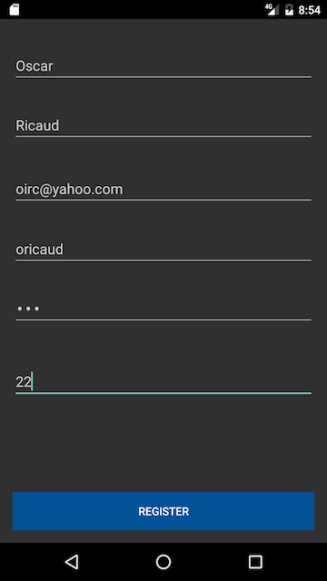
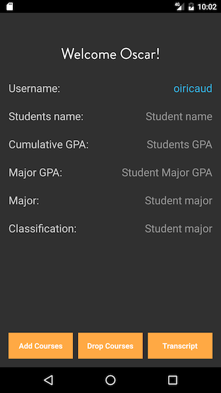
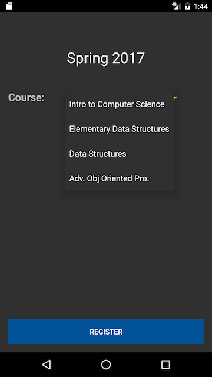

Description
======

This respiratory contains an android java application of a University Course Registration. To test this yourself, download this respiratory as a zip file and unzip the folder on your Desktop. Then open Android Studio and click on "Open an Existing Android Studio Project", find the unzip folder and import build.gradle.

The purpose of this respiratory is to allow new or existing users to create accounts and be able to sign up for their college courses. It is common for University students to enroll for their classes. Hence, this application will enhance the experience of the user to register through a mobile app.

How does it work?
======

The android application [launches](Screenshots/Home-2.png) and the [LoginActivity.java](app/src/main/java/com/registration/course/university/LoginActivity.java) class is first launched. This class contains two buttons, log in and create an account [RegisterActivity.java](app/src/main/java/com/registration/course/university/RegisterActivity.java). This works very well because of the files that are in the backend folder, [Login.php](backend/Login.php) & [Register.php](backend/Register.php). The latter files are stored in my domain and sends/receives requests each time the user creates an account or logs in. The database contains a simple table called [user](Screenshots/Database.png), which is where the information of the user is stored, i.e user_id (which auto increments each time a new account is created), name, username, age and password.  

Once the user creates an account they can input their credentials with the help of [Login.php](backend/Login.php) and [LoginActivity.java](app/src/main/java/com/registration/course/university/LoginActivity.java) and [LoginRequest.java](app/src/main/java/com/registration/course/university/LoginRequest.java) verifies if the user credentials are correct. If the credentials are correct @see [HomeActivity.java](app/src/main/java/com/registration/course/university/HomeActivity.java)  displays with a simple welcome home page.

Screenshots
======

Above, I have a table which contains new/register students' creditantials which are stored safely in the database.

Use Cases
======

Register - This use case allows for new users to create an account. To create an account the user must provide first and last name, email, username, password and age. 
  
Log in - The user could then log in with their existing credentials, then the credentials are verfied in the backend database. If they are correct the user is then prompted to the Home/Manage Schedule.

Home/Manage Schedule - This is the main function of the app. The user could add, drop courses or view their transcript.

Add Course - User could add courses which is sent to a database.
  
Drop Course - If the user has current classes register it can drop courses here. 
  
View Catalog

View Transcript
